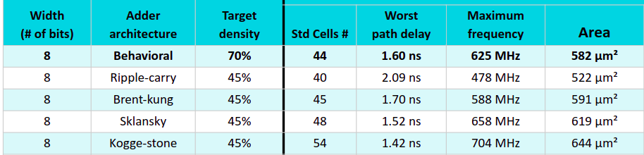

# Measuring the speed of optimised hardware adders

Teo's work (see below) gives us 4 options for hardware adder to use for ASIC and FPGA design.

The results in the table above are calculated by the OpenLane ASIC flow. We want to put these designs
on the next free Google shuttle to validate the timings.

## Aim of this project

* Characterise each type of adder, along with the standard Yosys adder 
* Build a way of measuring the performance close to the adder. We don't want to do it off the chip, as this will run into the same difficulties faced by [Andrew Zonenberg when he tried to characterise OpenRAM](https://www.youtube.com/watch?v=lMmzrAdkaB0).
* Some additional requirements:
    * Adder can't glitch while adding the 2 inputs because this could either violate timing or mess up the ring oscillator
    * We want to choose which paths through the adder, to be able to compare the simulation against the actual results
    * Measure how good our CAD environment is - did the prediction match the measurement?

## More about hardware adders

* Livestream https://www.youtube.com/watch?v=P7wjB2DKAIA
* The presentation slides - https://bit.ly/3MYTlCf
* Teo's Twitter - https://twitter.com/td_ene
* Teo's main repository - https://github.com/tdene/synth_opt_adders
* Colab notebook - https://colab.research.google.com/drive/1bqAWs2To8suxx5acmCYp10iWlKI-Qsn4

## Block diagram

The basic idea is to have a ring oscillator with 3 modes:

* Bypass - just the ring oscillating
* Control - add 4 additional inverters to help characterise the ring
* Adder - put one bit of the adder into the ring

In this way we can first measure the ring period, then see how it changes for each bit of the adders.

The netnames, inputs and outputs in this diagram (should) [match the Verilog source](src/instrumented_adder.v).

## Digital simulation

Trace shows the results of running the [cocotb test](test/test_adder.py).

* test_bypass_minimal
* test_adder_minimal
* test_bypass
* test_control
* test_adder_in_loop
* test_adder

To run the digital sim, type `make test_adder`

## Analog simulations

Shows the stop_b and ring_osc_out traces. These traces are to get an idea on the frequency of the ring oscillator loop with and without the adder.

The following show just for the behavioral adder. To check the other adders, look in the spice directory.

### Bypass loop - fastest

run `make analog_bypass`

### Control loop - adds 4 more inverters to the ring osc

run `make analog_control`

### Adder loop - slowest

run `make analog_adder`

## Hardening with OpenLane (and create spice files)

* Uncomment the adder you want in src/instrumented_adder.v
* Run `make spice/instrumented_adder.spice` to harden with OpenLane and copy spice file

# Prerequisites

* Install the adder library with `make install_adder`
* Build the source for the adders with `make all_adders`

# TODO (PRs welcome!)

[Log of work in progress](docs/log.md).

* how to keep the inverter loop - done
* check timing - looks good
* results still not quite making sense (see the [log](docs/log.md))
* remove ring_osc_out output to avoid loading the ring
* get STA report for ring_osc_counter
* define number of inverters in the loop
* check process corners
* update counter registers to 32b
* put inside group project wrapper
* caravel test

# Zero to ASIC Course

This project was made as part of the [Zero to ASIC Course](https://zerotoasiccourse.com)!

# License

This project is [licensed under Apache 2](LICENSE)
