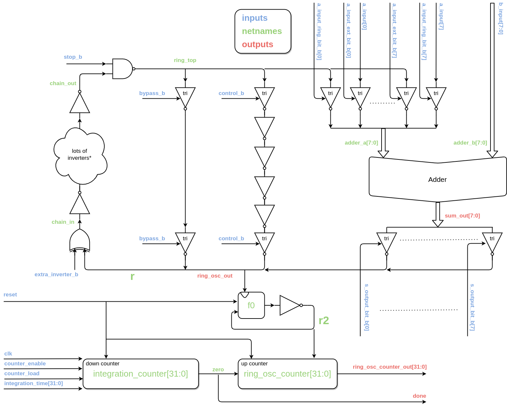
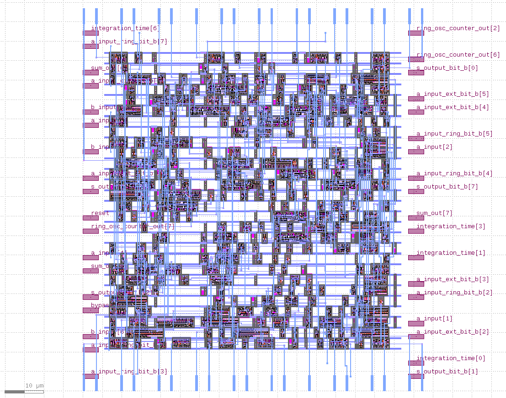
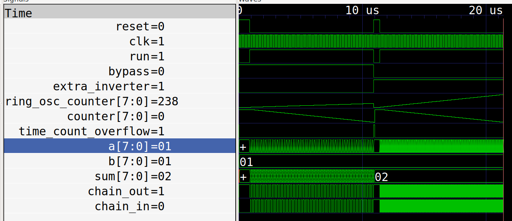
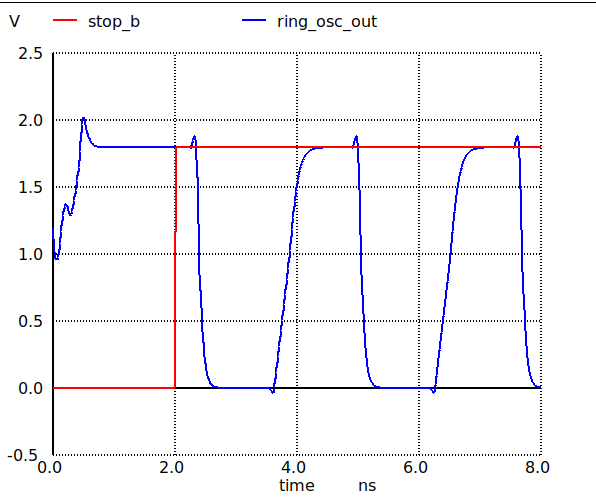
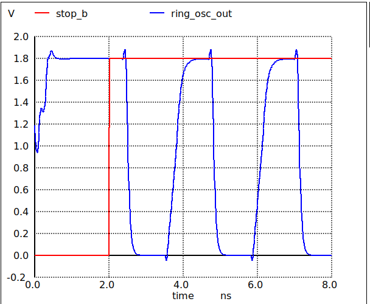
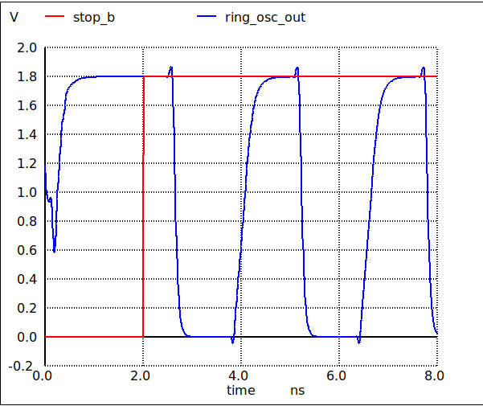

# Optimising hardware adders

* Livestream https://www.youtube.com/watch?v=P7wjB2DKAIA
* The presentation slides - https://bit.ly/3MYTlCf
* Teo's Twitter - https://twitter.com/td_ene
* Teo's main repository - https://github.com/tdene/synth_opt_adders
* Colab notebook - https://colab.research.google.com/drive/1bqAWs2To8suxx5acmCYp10iWlKI-Qsn4

# Aim

* Put one of each type of adder, along with the standard yosys adder
* Have a way of measuring the performance close to the adder (don't attempt to do it off the chip)
* Tapeout on MPW6
* Some hidden requirements
    * adder can't glitch while adding the 2 inputs because this could either violate timing or mess up the ring osc
    * we want to choose which paths through the adder, to be able to compare the simulation against the actual results
    * how good is our cad environment? did the prediction match the measurement

## Block diagram

The labels and inputs/outputs in this diagram [match the source](src/instrumented_adder.v).

## GDS 

## Digital simulation

Trace shows the results of running the [cocotb test](test/test_adder.py).

* test_bypass_minimal
* test_adder_minimal
* test_bypass
* test_control
* test_adder_in_loop
* test_adder

To run the digital sim, type `make test_adder`

## Analog simulations

Shows the stop_b and ring_osc_out traces. These traces are to get an idea on the frequency of the ring oscillator loop with and without the adder.

The following show just for the behavioral adder. To check the other adders, look in the spice directory.

### Bypass loop - fastest

run `make analog_bypass`

### Control loop - adds 4 more inverters to the ring osc

run `make analog_control`

### Adder loop - slowest

run `make analog_adder`

# Harden with OpenLane (and create spice files)

* Uncomment the adder you want in src/instrumented_adder.v
* Run `make spice/instrumented_adder.spice` to harden with OpenLane and copy spice file

## Prerequisites

* Install the adder library with `make install_adder`
* Build the source for the adders with `make all_adders`

# TODO! (prs welcome!)

[Log of work in progress](docs/log.md)

* Check the instrumentation
    * how to keep the inverter loop - done
    * check timing - looks good
    * results still not quite making sense (see the [log](docs/log.md))

# Zero to ASIC Course

This project was made as part of the [Zero to ASIC Course](https://zerotoasiccourse.com)!

# License

This project is [licensed under Apache 2](LICENSE)
