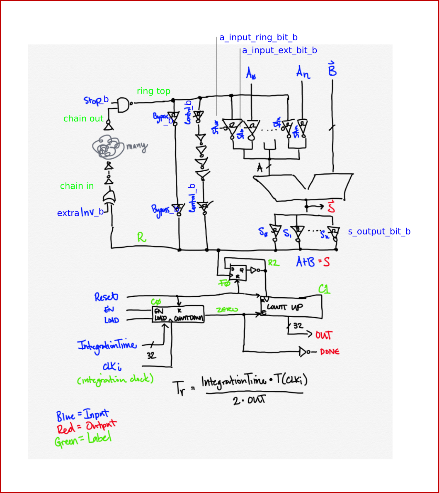
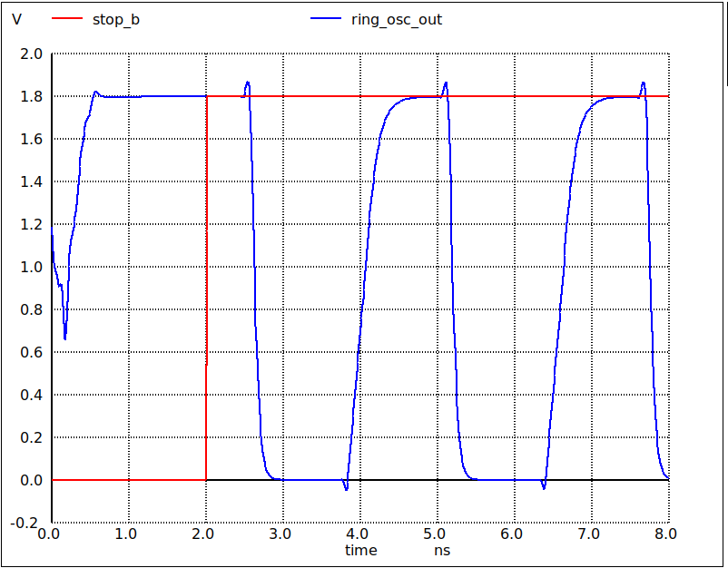

# Optimising hardware adders

* Livestream https://www.youtube.com/watch?v=P7wjB2DKAIA
* The presentation slides - https://bit.ly/3MYTlCf
* Teo's Twitter - https://twitter.com/td_ene
* Teo's main repository - https://github.com/tdene/synth_opt_adders
* Colab notebook - https://colab.research.google.com/drive/1bqAWs2To8suxx5acmCYp10iWlKI-Qsn4

# Aim

* Put one of each type of adder, along with the standard yosys adder
* Have a way of measuring the performance close to the adder (don't attempt to do it off the chip)
* Tapeout on MPW6
* Some hidden requirements
    * adder can't glitch while adding the 2 inputs because this could either violate timing or mess up the ring osc
    * we want to choose which paths through the adder, to be able to compare the simulation against the actual results
    * how good is our cad environment? did the prediction match the measurement

Trace shows 2 runs, with and without the adder in the ring oscillator path.

# Simulation

* Digital sim, run `make test_adder`
* Analog sim, run `make analog_sim`

# Harden with OpenLane (and create spice files)

* Uncomment the adder you want in src/instrumented_adder.v
* Run `make spice/instrumented_adder.spice` to harden with OpenLane and copy spice file

# TODO! (prs welcome!)

[Log of work in progress](docs/log.md)

* Check the instrumentation
    * how to keep the inverter loop - done
    * check timing - looks good
    * results still not quite making sense (see the [log](docs/log.md))

# Zero to ASIC Course

This project was made as part of the [Zero to ASIC Course](https://zerotoasiccourse.com)!

# License

This project is [licensed under Apache 2](LICENSE)
