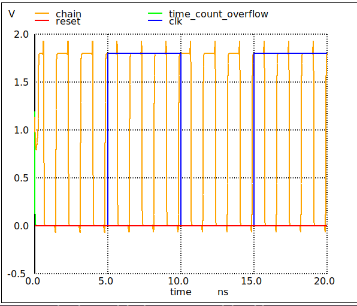

# Sat 28 May 09:34:10 CEST 2022

* Eric & Thomas figured out the bypass simulation issue (rise time was a lot slower in the ring osc loop)
* The a input were left floating. Yet to understand how this would affect the loop given the sum output was also disconnected
* Updated the spice files, with rise time measurement. 
* Added a new control spice simulation for the control loop.

## bypass

loop_period         =  2.122721e-09 targ=  5.835074e-09 trig=  3.712353e-09
rise_time           =  3.584483e-10 targ=  3.781068e-09 trig=  3.422620e-09

## control

loop_period         =  2.311541e-09 targ=  6.207395e-09 trig=  3.895854e-09
rise_time           =  3.521670e-10 targ=  3.965702e-09 trig=  3.613535e-09

## adder

loop_period         =  2.578595e-09 targ=  6.756978e-09 trig=  4.178383e-09
rise_time           =  3.702593e-10 targ=  4.261381e-09 trig=  3.891121e-09

# Thu 26 May 12:21:58 CEST 2022

working on branch eric-update to add the extra features:

* Add flip-flop F0.  This reduces the load on net R and makes it easier for C1 to make timing.  Since long integration times are needed the div 2 shouldn't cause a significant loss in resolution on the measurement. 
* Add a control measurement.  Everything is relative to the bypass path but adding a second control path, with just a small number of inverters, can help to establish that the apparatus is actually measuring what we think it is, and since the delay is small it can help to establish the noise floor of the measurement.  Also, since we will have two measurements (bypass and control) we can get a decent measurement of the delay of one inverter and that measurement should allow us to determine the number of inverters in the control path, which is of course known by design, further establishing the accurracy of the system.
* I also labeled some stuff to make it easier to talk about in chat
* I tried to make it more clear that C0 measures the time that C1 counts

| name             | time for 1 loop      | bit connected | number inverters 
| ---------------- | -------------------- | ------------- | ---------------- 
|yosys bypass      | 2.021624e-09         |  7            |  21              
|yosys adder       | 2.550314e-09         |  7            |  21              
|ripple adder      | 2.566192e-09         |  7            |  21              
|sklansky adder    | 2.560252e-09         |  7            |  21              
|kogge-stone adder | 2.565573e-09         |  7            |  21              

* bypass simulation looks a bit dodgy
* numbers don't look great

## Questions

* for spice sims, it's good to have the ring osc as a separate output. can spice 'reach inside' a module?
* the done inverter - not needed?

# Thu 26 May 11:04:47 CEST 2022

* updated with Teo's latest & greatest
* change bypass behaviour so full adder can be tested
* tested all adder types with all input possibilities
* rehardened all
* changed sim to only get 2 or 3 cycles (12ns length)

| name             | time for 1 loop      | bit connected | number inverters | extra inv
| ---------------- | -------------------- | ------------- | ---------------- | ---------
|yosys bypass      | 1.781721e-09         |  7            |  21              | 1
|yosys adder       | 2.420212e-09         |  7            |  21              | 0
|ripple adder      | 2.439424e-09         |  7            |  21              | 0
|sklansky adder    | 2.499714e-09         |  7            |  21              | 0
|kogge-stone adder | 2.247947e-09         |  7            |  21              | 0

Looks better than before, though doesn't agree with Teo's results. Sklansky should be the fastest and here it's the slowest.

Teo's results:

* Ripple-carry 637 MHz
* Behavioral 730 MHz
* Brent-kung 826 MHz
* Kogge-stone 840 MHz
* Sklansky 926 MHz

# Wed 25 May 12:46:15 CEST 2022

* updated to ngspice3.7
* added harden rule to Makefile 
* fixed bypass reversal
* given up on Pyspice
* have 2 spice files for with and without bypass adder
* results seem wrong (see below)
* using bit 7 of the adder, reharden, fails to oscillate with adder. bypass as before. increase number of inverters to 101 (from 21)
* pretty cumbersome to changes adders at the moment. have to change:
    * config.tcl for source,
    * the makefile for test rule, 
    * the instrumented_adder.v, for the include
    * re-harden
* And waveform of the ring is no good. bad reset? Trying different spice setup
* Doing a separate reset and run seems to improve the ring osc waveform
* but then kogge-stone stopped oscillating, so had to include extra inverter
* Teo updated lib to prepend module names, so all can be included. Now updating spice needs:
    * change verilog
    * reharden

## STA notes from Eric

* reads the liberty file, figure out the paths, add them and make sure match the timing contraint
* should compare with the spice sim, as STA tool uses spice for measurements
* one limitation is related to logical effort, depends on fanout in the design
* STA program takes a command file, and can give this -> a[0] to s[2], and then this should be in the report
* have a make rule for the STA tool to dump just the paths I'm interested in.
* need to do the simulation with the parasitics to verify it as a last step
* how to choose number of inverters and length of counters
    * put counter in separate block, set a timing constraint
    * make sure the ring osc is longer than the counter on all corners
* longer the integration time the higher accuracy, but this also means the fluctations could start to matter

## Results

All measurements in seconds and are time for 7 ring oscillation periods (check .meas setup in spice file)

| name             | time for n loops      | bit connected | number inverters | extra inv
| ---------------- | --------------------- | ------------- | ---------------- | ---------
|yosys bypass      | 1.833742e-08       7  |  0            |  21              | 1
|ripple bypass     | 1.828263e-08       7  |  0            |  21              | 1
|sklansky bypass   | 1.828272e-08       7  |  0            |  21              | 1
|kogge-stone bypass| 1.833742e-08       7  |  0            |  21              | 1
|yosys adder       | 2.148156e-08       7  |  0            |  21              | 0        
|ripple adder      | 2.094202e-08       7  |  0            |  21              | 0
|sklansky adder    | 2.095268e-08       7  |  0            |  21              | 0        
|kogge-stone adder | 2.094274e-08       7  |  0            |  21              | 0        

| name             | time for n loops      | bit connected | number inverters | extra inv
| ---------------- | --------------------- | ------------- | ---------------- | ---------
|yosys bypass      | 1.245878e-08       7  |  7            |  21              | 1
|yosys adder       | 1.275221e-08       7  |  7            |  21              | 0        
|sklansky adder    | 1.286283e-08       7  |  7            |  21              | 0        
|ripple adder      | 1.285714e-08       7  |  7            |  21              | 0
|kogge-stone adder | 1.285516e-08       7  |  7            |  21              | 0        

These took too long, so measured 6 loops, then divide by 6, multiply by 7 to compare above 

| name             | time for n loops      | bit connected | number inverters | extra inv
| ---------------- | --------------------- | ------------- | ---------------- | ---------
|yosys adder       | 1.911594e-08       6  |  0            |  21              | 0
|sklansky adder    | 1.867272e-08       6  |  0            |  21              | 0        
|kogge-stone adder | 1.866273e-08       6  |  0            |  21              | 0
|ripple adder      | 1.865568e-08       6  |  0            |  21              | 0
|kogge-stone adder | 2.1773  8-08   (6) 7  |  0            |  21              | 0        

# Tue 24 May 12:29:46 CEST 2022

* Adding the [.spiceinit](../spice/.spiceinit) file drops simulation time from 50 minutes down to 2:30. See this [ngspice note](http://ngspice.sourceforge.net/applic.html)
* useful ngspice stuff: display to show all vectors. Then use "" to be able to plot vectors like ring_osc_counter[0] (needs quotes to work)
* overflow never going high, put the counter on external pins and were floating? maybe not reset properly? tried adding or posedge reset and that failed to floorplan(!), moved back to up counter and used external inputs as compare
* think I might have been copying the wrong spice file
* learnt the measure tool to count ring osc cycles
* with bypass 8 cycles takes 1.43e-8 s and without 1.34e-8 s

# Mon 23 May 12:46:45 CEST 2022

* adding uic (thanks Thomas) to .tran helps simulation run [see this pic](spice_pics/sim1.png)
* still takes about an hour. Thomas can get it to run an <1 minute so trying to get the same setup here

# Thu 19 May 11:01:18 CEST 2022

* fixed the issue with the mismatched reset names.
* 10 inverters, chain oscillates at 0.69ns = 1.6GHz.
* takes about 3:30 to run
* use the spice file from the openlane run and remove magic steps by including the primitives spice file
* add the if/else to use inverters or delays
* added [a fake adder](../src/fake_adder.v)
* analog simulation takes too long > 1 hour.
* trying with only 10 inverters, updated the tests and changed to a down counter
* fails

# Wed 18 May 16:08:55 CEST 2022

Be on commit 6eb633ea6bb33440104e7584073c98a0a11cab58 to reproduce this issue. Fixed with a working reset. 

Trying to simulate a [ring of inverters](../src/instrumented_adder.v). I don't think this can be done with the digital sim tools, so I am 
trying to use a spice file extracted from the GDS of the hardened verilog.

## Use OpenLane to build GDS

    make mount
    ./flow -design wrapped_instrumented_inverter

I added the complete run directory: [runs/RUN_2022.05.18_14.08.09](../runs/RUN_2022.05.18_14.08.09).

Configuration [config.tcl](../config.tcl) needed 'set ::env(SYNTH_READ_BLACKBOX_LIB) 1' setting.

## Check synth log

    cat runs/RUN_2022.05.18_14.08.09/reports/synthesis/1-synthesis.stat.rpt.strategy4

    === instrumented_adder ===

       Number of wires:                 26
       Number of wire bits:             29
       Number of public wires:          14
       Number of public wire bits:      17
       Number of memories:               0
       Number of memory bits:            0
       Number of processes:              0
       Number of cells:                 27
         sky130_fd_sc_hd__a21oi_2        2
         sky130_fd_sc_hd__a31o_2         2
         sky130_fd_sc_hd__a41o_2         1
         sky130_fd_sc_hd__and2b_2        1
         sky130_fd_sc_hd__buf_1          3
         sky130_fd_sc_hd__dfxtp_2        4
         sky130_fd_sc_hd__inv_2         10
         sky130_fd_sc_hd__nor2_2         3
         sky130_fd_sc_hd__o21a_2         1

       Chip area for module '\instrumented_adder': 216.457600

## Get non-blackboxed spice file

    cd runs/RUN_2022.05.18_14.08.09/results/final/gds
    ln -s ../../finishing/.magicrc # get a local copy of magicrc file to be able to open the gds with magic
    magic instrumented_adder.gds

Then in the magic command window type:

    extract
    ext2spice lvs
    ext2spice
    quit

Then you will have the full spice file. I've copied this to [./spice/instrumented_adder.spice](../spice/instrumented_adder.spice)

## Try to simulate with spice

Check the commented [spice/simulation.spice](../spice/simulation.spice) file. It provides power, clock and an initial reset.
The [simulation fails to converge](../spice/spice.log) and I never get to see the inverter loop oscillating.

    cd spice
    ngspice simulation.spice

If you want to run the simulation, change the PDK include line at the top of simulation.spice to match your local library install.

